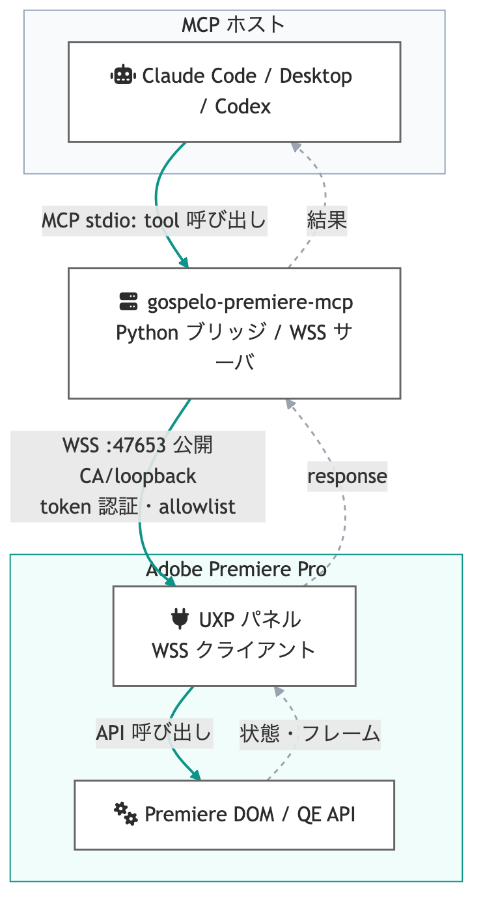
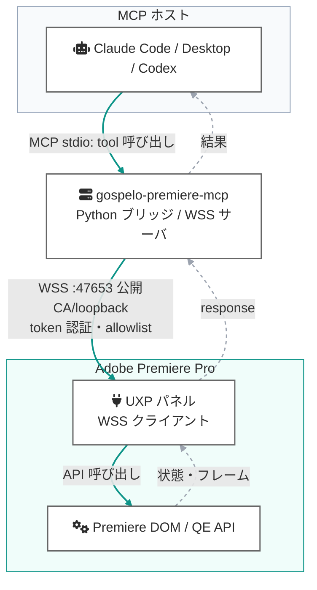
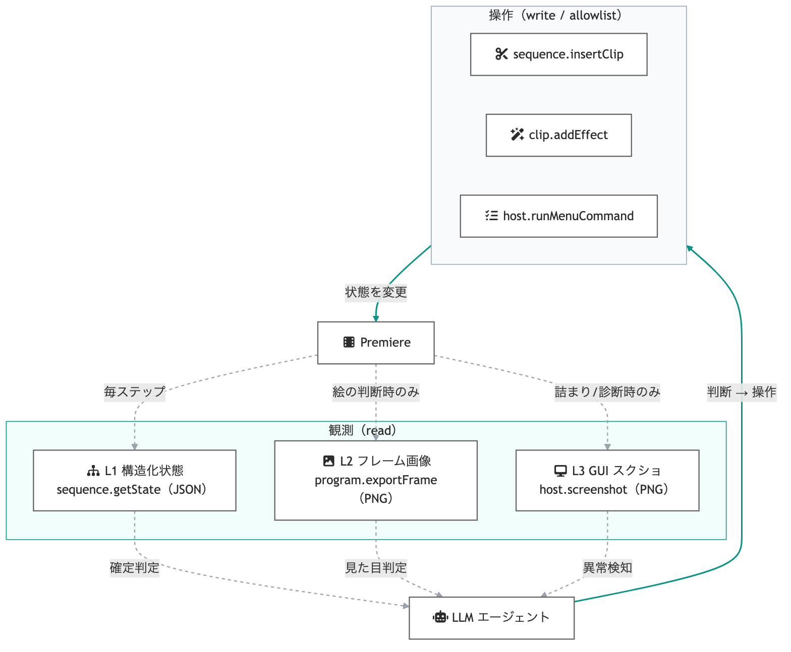
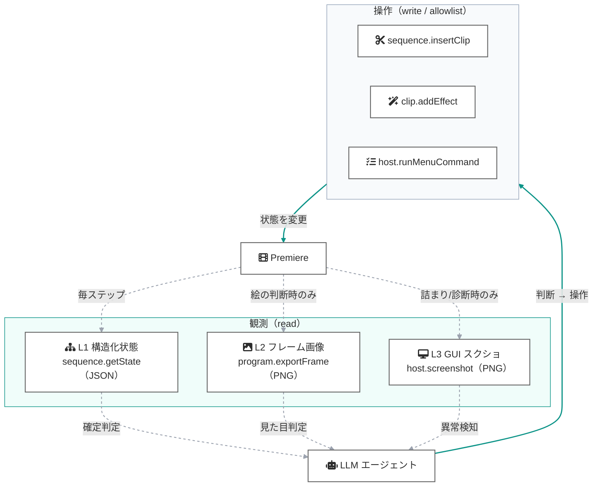
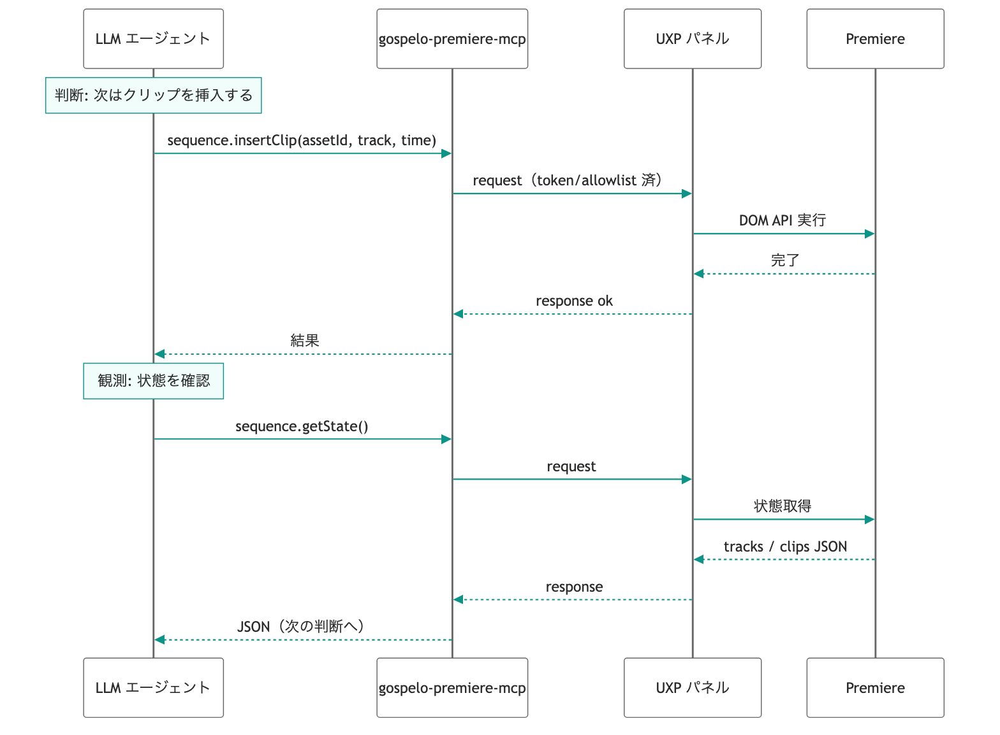
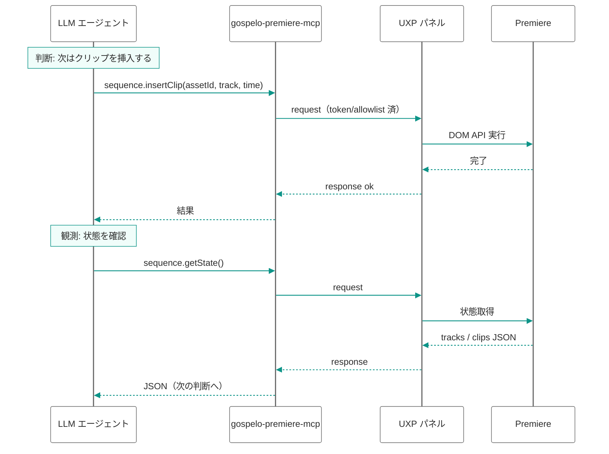

# Premiere 自律編集エージェント 設計（全体像）

Premiere Pro を LLM から自律的に操作・判断するための全体設計。既存の
`gospelo-premiere-mcp` ブリッジを土台に、「操作（write）」と「観測（read）」を
明確に分け、観測を 3 層に構造化することで、長い手順を安定して回すことを狙う。

- **現状**: WSS ブリッジは接続確立済み。公開 CA 証明書で TLS、token 認証、
  allowlist（読み取り 4 + 書き込み 18 の計 22 メソッド）で稼働。動作確認済み
  ツールの詳細は [mcp-tools.md](mcp-tools.md) を参照。write 系のテストは
  使い捨てプロジェクト（`project.create` で作成）で行う。
- **本設計**: この土台に観測 3 層（L1/L2/L3）と操作メソッド群を、
  reviewed method として段階的に追加する。

---

## 1. システム全体構成

MCP ホストからのツール呼び出しを、ローカルの Python ブリッジ（WSS サーバ）が
受け、Premiere 内の UXP パネル（WSS クライアント）へ中継する。パネルが
Premiere の DOM / QE API を叩き、結果を返す。

Mermaid source

| 要素 | 役割 | 備考 |
|---|---|---|
| MCP ホスト | LLM 実行環境 | 各ホストの `env` に token/cert/key を保持 |
| Python ブリッジ | WSS サーバ・中継・allowlist 検証 | loopback bind、token 必須 |
| UXP パネル | WSS クライアント・API 実行 | UXP はサーバを持てないので client 側 |
| Premiere API | DOM（公式）/ QE（非公式） | 操作の実体 |

---

## 2. 観測を 3 層に分ける

自律ループの品質は「観測」で決まる。スクショ一択にせず、用途で 3 層に分け、
**主軸を構造化状態（L1）に置き、画像（L2/L3）は必要な局面に限定**する。

Mermaid source

| 層 | 手段 | 判断できること | 頻度 | 信頼性 / コスト |
|---|---|---|---|---|
| **L1 構造化状態** | DOM で JSON 取得（トラック/クリップ/in-out/位置/プレイヘッド） | 「意図した状態になったか」 | 毎ステップ | 高信頼・低コスト・確定的 |
| **L2 フレーム画像** | `Exporter` で現フレームを PNG | 「絵として正しい/良いか」（色・構図） | 絵の判断時 | 視覚判断に必須・中コスト |
| **L3 GUI スクショ** | OS `screencapture` | L1/L2 で拾えない状態（ダイアログ・エラー・API 外） | 詰まり/診断時 | 補助・要権限・脆い |

**設計原則**: 毎ステップ L1、必要時だけ L2/L3。画像依存を減らすほど、
速度・コスト・誤読の面で安定する。

---

## 3. 自律ループ（操作 → 観測 → 判断）

1 サイクル = 「操作を 1 つ実行 → 状態を観測 → LLM が成否と次手を判断」。
下記は「クリップ挿入 → 状態確認」の 1 サイクル。

Mermaid source

失敗検知を確実にするため、L1 の状態 JSON に「直近エラー / モーダル有無」など
異常シグナルを含めると、L3（スクショ）に頼らず異常を捕まえられる。

---

## 4. セキュリティ設計

Blender MCP 型の「任意コード exec」は強力だが大きな穴になる。本設計は逆に、
**任意 eval を開けず、必要な操作を reviewed method として 1 つずつ追加**する
中間路線を採る（現行 README の方針を維持）。

| 層 | 対策 |
|---|---|
| 転送 | WSS（公開 CA 証明書）、loopback bind |
| 認証 | 32 文字以上の共有 token（hello ハンドシェイク） |
| 認可 | メソッド allowlist（未登録メソッドは拒否） |
| 操作粒度 | 高レベルメソッドのみ公開（生の eval / 任意スクリプトは非公開） |
| 強権限の隔離 | L3（画面収録）は明示 opt-in・撮影条件を限定 |

---

## 5. 実装ロードマップ

| 段階 | 追加メソッド | 種別 | 状態 |
|---|---|---|---|
| 0 | `project.assets.list` | read | 実装済み |
| 1 | `sequence.getState`（L1） | read | 実装済み（実機検証済み） |
| 2 | `program.exportFrame`（L2） | read | 実装済み（実機検証済み） |
| 3 | `sequence.insertClip` / `sequence.addMarker` | write（公式 DOM） | 実装済み（実機検証済み） |
| 3+ | `project.create`（使い捨てテスト用プロジェクト作成） | write | 実装済み（実機検証済み） |
| 3+ | `sequence.importCaptions`（SRT 読み込み。配置は手動 1 ドラッグ） | write | 実装済み（実機検証済み） |
| 3+ | `sequence.insertMogrt` + `premiere_add_telops`（編集可能テロップの完全自動配置） | write | 実装済み（実機検証済み） |
| 4 | `sequence.addEffect`（公式 VideoFilterFactory — QE 不要で達成） | write | 実装済み（実機検証済み） |
| 5 | `host.runMenuCommand`（ID allowlist） | write | 予定 |
| 6 | `host.screenshot`（L3） | read（強権限） | 任意 |

**投資対効果の順**: まず L1（`sequence.getState`）を厚くする。自律判断の大半は
ここで賄え、画像観測の回数を減らせる。次に L2 で「観測ループが回る」体験を作り、
その後に write 系（段階 3 以降）を足していく。

---

## 補足: Premiere API の到達範囲

- 公式 UXP DOM は広範（プロジェクト/シーケンス/マーカー/書き出し/メニュー実行 等）だが
  **完全ではない**（例: クリップのトラック間 垂直移動は API が存在しない）。
- QE DOM（`app.enableQE()`）は公式に無い操作（エフェクト適用等）を補うが、
  **非公式・非サポート・バージョンで壊れやすい**。
- どの API にも無い操作は OS レベル UI 自動化に頼るしかなく、脆く別枠。
- 使える DOM API は Premiere 本体バージョンに依存する（例: Premiere v25.6 = UXP v8.1）。
