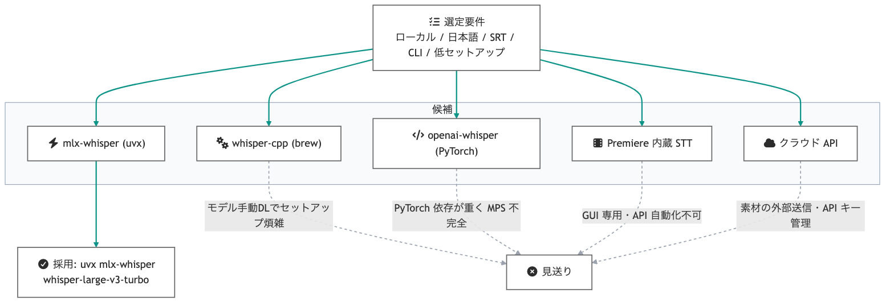
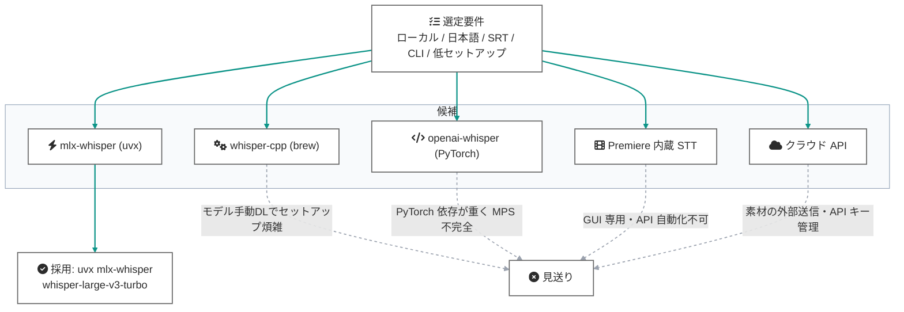

# 文字起こしエンジン技術選定: mlx-whisper

テロップ自動生成パイプライン（`premiere_add_telops`）の入力となる SRT を
生成する文字起こしエンジンの選定記録。2026-07-12、実機検証に基づき
**uvx mlx-whisper（モデル: whisper-large-v3-turbo）** を採用した。

## 選定要件

| # | 要件 | 理由 |
|---|---|---|
| 1 | **ローカル完結** | 制作素材（ナレーション音声）を外部へ送信しない |
| 2 | **日本語精度** | ナレーションは日本語。誤字はテロップ品質に直結 |
| 3 | **タイムコード付き SRT 出力** | キューの開始/終了秒がテロップ配置の座標になる |
| 4 | **CLI で自動化可能** | LLM エージェントが人手なしで呼び出せること |
| 5 | **セットアップ最小** | mediakit の思想（ffmpeg 同様の外部 CLI 依存・薄いラッパー） |
| 6 | **Apple Silicon で高速** | 開発・運用環境は M 系 Mac |

## 候補比較

| 候補 | ローカル | 日本語 | SRT | CLI 自動化 | セットアップ | Apple Silicon 速度 |
|---|---|---|---|---|---|---|
| **mlx-whisper (uvx)** | ✓ | ✓ (large-v3-turbo) | ✓ | ✓ | **uvx で都度実行・インストール不要**（初回のみモデル DL） | **MLX = Apple GPU 最適化** |
| whisper-cpp (brew) | ✓ | ✓ | ✓ | ✓ | brew + **モデル手動 DL が別途必要** | Metal 対応で速いが構成が手間 |
| openai-whisper (PyTorch) | ✓ | ✓ | ✓ | ✓ | pip + PyTorch 依存が重い | MPS 対応が不完全で実質 CPU 寄り |
| Premiere 内蔵 Speech to Text | ✓ | ✓ | ✓ (書き出し) | **✗ GUI 操作のみ**（UXP API 非公開） | 追加ツール不要 | - |
| クラウド API (OpenAI 等) | **✗ 外部送信** | ✓ | ✓ | ✓ | API キー管理 | -（ネットワーク依存） |

## 選定フロー



<details><summary>Mermaid source</summary>



</details>

- **whisper-cpp**: 性能は十分だが、モデルファイルの手動ダウンロードと管理が
  必要で「エージェントが人手なしで完結」の要件に一段劣る
- **openai-whisper**: PyTorch 依存が重く、Apple Silicon では実質 CPU 実行
- **Premiere 内蔵 STT**: 品質は高いが UXP API が公開されておらず GUI 操作が必須
  （本パイプラインの「手動ゼロ」要件と非両立）
- **クラウド API**: 制作素材の外部送信が要件 1 に抵触

## パイプラインでの位置づけ


<details><summary>Mermaid source</summary>


</details>

## 採用構成

```bash
uvx --from mlx-whisper mlx_whisper INPUT.mp4 \
  --model mlx-community/whisper-large-v3-turbo \
  --language ja \
  --output-format srt \
  --output-dir OUT_DIR
```

| 項目 | 値 | 備考 |
|---|---|---|
| 実行方式 | `uvx`（都度実行） | 恒久インストール不要。mediakit への Python 依存追加もなし |
| モデル | `mlx-community/whisper-large-v3-turbo` | 日本語精度と速度のバランス。初回のみ数百 MB を DL（以後キャッシュ） |
| 言語 | `--language ja` | 自動判定より安定 |
| 出力 | `--output-format srt` | `premiere_add_telops` の入力形式 |

## 検証結果（2026-07-12 実機）

- 入力: `misaki_0.mp4`（AI 生成ナレーション、7.2 秒）
- 出力 SRT: `00:00:00,000 --> 00:00:05,280` /
  「こちらは（製品名）で最初に表示されるスケジュール画面になります」
- **誤字なし・タイムコード正確**。この SRT をそのまま `premiere_add_telops` に
  渡し、テロップとして正しい時刻・長さで描画されることまで確認済み

## リスクと代替

| リスク | 影響 | 代替 |
|---|---|---|
| MLX は Apple Silicon 専用 | Intel Mac / Windows では動かない | `whisper-cpp`（Metal/CUDA/CPU）へ差し替え。SRT 出力なのでパイプライン側は無変更 |
| 初回モデル DL に時間 | 初回のみ数分 | キャッシュ（Hugging Face ハブ）以後はオフラインで完結 |
| 長尺・多話者で精度低下の可能性 | テロップ修正の手間 | テロップは Essential Graphics で編集可能なため、修正コストは低い |

## 関連ドキュメント

- [premiere_uxp_bridge/mcp-tools.md](../premiere_uxp_bridge/mcp-tools.md) — `premiere_add_telops` リファレンス
- [premiere_uxp_bridge/agent-architecture.md](../premiere_uxp_bridge/agent-architecture.md) — 全体設計
