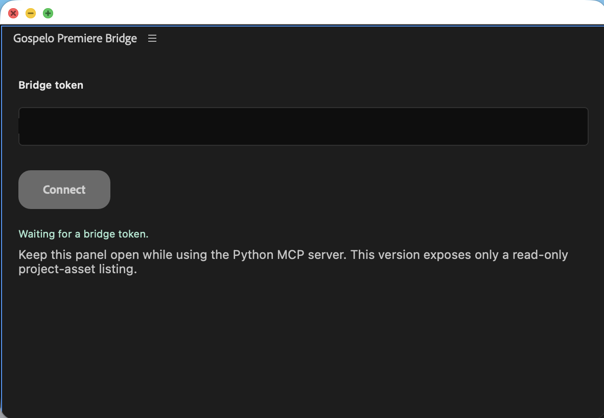
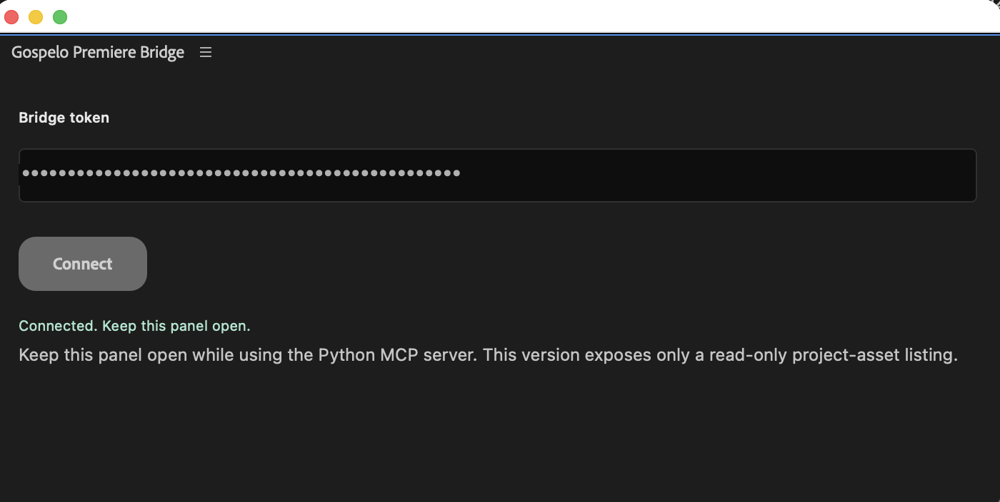
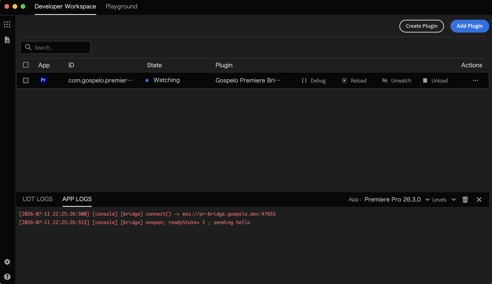

# Gospelo Premiere Bridge (UXP panel)

This is the Premiere-side companion for `gospelo-premiere-mcp`. It is a UXP
panel, not a standalone application. The panel opens an authenticated outbound
WSS connection to the local Python MCP server and currently supports only one
read-only operation: recursively listing the active project's assets.

## Why a public certificate is required

Premiere UXP allows WebSocket *clients*, not servers, and on macOS it blocks
insecure HTTP, so the transport must be `wss://`. The important constraint is
the certificate:

- **UXP trusts only publicly-issued certificates.** Self-signed certs, `mkcert`,
  a private CA, and certificates you manually trust in the macOS keychain are
  all rejected. A `wss://127.0.0.1` endpoint with a self-signed cert fails the
  TLS handshake (the panel logs an `onclose` with `code=1006` and no reason).

The working setup is therefore:

1. Get a **public-CA certificate** (e.g. Let's Encrypt) for a hostname you
   control, such as `pr-bridge.gospelo.dev`.
2. Map that hostname to loopback in `/etc/hosts`:

   ```
   127.0.0.1 pr-bridge.gospelo.dev
   ```

3. Serve that certificate from the local Python bridge and point the panel at
   `wss://pr-bridge.gospelo.dev:47653`.

The certificate is validated against the public trust chain, but the connection
never leaves the machine — the hostname resolves to `127.0.0.1`.

## Prerequisites

- Adobe Premiere Pro `25.6.0` or later.
- Adobe UXP Developer Tool `2.2` or later.
- A hostname you control with DNS you can edit (for the ACME DNS-01 challenge).
- A public-CA (Let's Encrypt) certificate + private key for that hostname.

## One-time setup

### 1. Obtain a public-CA certificate

Use any ACME client. With DNS-01 (works even though the host only resolves to
loopback), for example with `acme.sh` and a Cloudflare-managed zone:

```bash
acme.sh --issue --dns dns_cf -d pr-bridge.gospelo.dev --keylength ec-256
```

This yields a fullchain certificate and a private key, e.g.:

```
~/.acme.sh/pr-bridge.gospelo.dev_ecc/fullchain.cer
~/.acme.sh/pr-bridge.gospelo.dev_ecc/pr-bridge.gospelo.dev.key
```

Let's Encrypt certificates expire after 90 days; `acme.sh` installs a cron job
to renew automatically. Restart the bridge after a renewal.

### 2. Map the hostname to loopback

```bash
echo "127.0.0.1 pr-bridge.gospelo.dev" | sudo tee -a /etc/hosts
```

### 3. Start the MCP bridge with that certificate and a shared token

The token must be at least 32 characters and is entered verbatim in the panel.
The bridge binds to loopback only.

```bash
export GOSPELO_PREMIERE_BRIDGE_TOKEN="replace-with-a-random-32-plus-character-token"
export GOSPELO_PREMIERE_BRIDGE_CERT="$HOME/.acme.sh/pr-bridge.gospelo.dev_ecc/fullchain.cer"
export GOSPELO_PREMIERE_BRIDGE_KEY="$HOME/.acme.sh/pr-bridge.gospelo.dev_ecc/pr-bridge.gospelo.dev.key"
gospelo-premiere-mcp
```

Other overrides: `GOSPELO_PREMIERE_BRIDGE_HOST` (default `127.0.0.1`),
`GOSPELO_PREMIERE_BRIDGE_PORT` (default `47653`), and
`GOSPELO_PREMIERE_EXPORT_DIR` (default directory that
`premiere_export_frame` writes still images into; falls back to a
`gospelo_premiere_frames` folder under the system temp dir).

### 4. Load the panel and connect

1. In UXP Developer Tool, **Add Plugin** and load the `premiere_uxp_bridge/`
   directory, then **Load** it into Premiere.
2. Open the **Gospelo Premiere Bridge** panel (Window → UXP Plugins) and enter
   the same token, then select **Connect**.

   

3. On success the panel shows `Connected. Keep this panel open.`

   

   The UXP Developer Tool APP LOGS shows the connection lifecycle (the panel
   logs at Error level so these entries are visible under the default filter).

   

4. From the MCP host, call `premiere_bridge_status`, then
   `premiere_list_project_assets`.

## Using a different hostname

`pr-bridge.gospelo.dev` is only an example. To use your own hostname, change it
in **both** places (they must match your certificate):

- `premiere_uxp_bridge/index.js` — the `BRIDGE_URL` constant.
- `premiere_uxp_bridge/manifest.json` — `requiredPermissions.network.domains`
  (e.g. `["wss://your-host.example.com"]`; the entry is the scheme+host without
  a port).

## Result shape

```json
{
  "ok": true,
  "project": {"id": "…", "name": "Edit", "path": "/…/Edit.prproj"},
  "assets": [
    {"id": "…", "parentId": "…", "name": "Interviews", "kind": "bin"},
    {"id": "…", "parentId": "…", "name": "A001.mov", "kind": "media", "mediaPath": "/…/A001.mov", "offline": false}
  ]
}
```

## Troubleshooting

- **`onclose code=1006`, no reason, immediately after connecting** — TLS trust
  failure. The certificate is not publicly trusted (self-signed / mkcert /
  private CA), or the panel's hostname does not match the certificate.
- **`Manifest entry not found`** — the `network.domains` entry is malformed.
  Use the scheme+host form (`wss://your-host.example.com`) without a port; an
  IP+port entry is rejected.
- **Connects then disconnects on a request** — token mismatch or the bridge is
  not running; confirm the token and that `gospelo-premiere-mcp` is up.

## Scope

The bridge accepts only `project.assets.list`. All future editing features must
be introduced as explicit, separately reviewed methods. Do not turn this bridge
into an arbitrary code-execution or GUI-automation channel.
